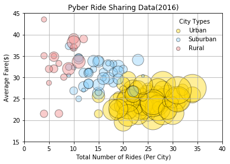
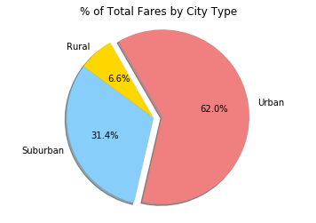
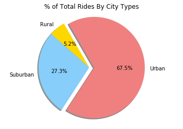
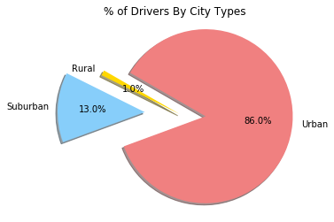

```python
import pandas as pd
import matplotlib.pyplot as plt
import seaborn as sns
import numpy as np
```


```python
citydata = "city_data.csv"
ridedata = "ride_data.csv"
```


```python
citydata_df = pd.read_csv(citydata)
citydata_df.head()
```


<div>
<style scoped>
    .dataframe tbody tr th:only-of-type {
        vertical-align: middle;
    }

    .dataframe tbody tr th {
        vertical-align: top;
    }

    .dataframe thead th {
        text-align: right;
    }
</style>
<table border="1" class="dataframe">
  <thead>
    <tr style="text-align: right;">
      <th></th>
      <th>city</th>
      <th>driver_count</th>
      <th>type</th>
    </tr>
  </thead>
  <tbody>
    <tr>
      <th>0</th>
      <td>Kelseyland</td>
      <td>63</td>
      <td>Urban</td>
    </tr>
    <tr>
      <th>1</th>
      <td>Nguyenbury</td>
      <td>8</td>
      <td>Urban</td>
    </tr>
    <tr>
      <th>2</th>
      <td>East Douglas</td>
      <td>12</td>
      <td>Urban</td>
    </tr>
    <tr>
      <th>3</th>
      <td>West Dawnfurt</td>
      <td>34</td>
      <td>Urban</td>
    </tr>
    <tr>
      <th>4</th>
      <td>Rodriguezburgh</td>
      <td>52</td>
      <td>Urban</td>
    </tr>
  </tbody>
</table>
</div>


```python
ridedata_df = pd.read_csv(ridedata)
ridedata_df.head()
```


<div>
<style scoped>
    .dataframe tbody tr th:only-of-type {
        vertical-align: middle;
    }

    .dataframe tbody tr th {
        vertical-align: top;
    }

    .dataframe thead th {
        text-align: right;
    }
</style>
<table border="1" class="dataframe">
  <thead>
    <tr style="text-align: right;">
      <th></th>
      <th>city</th>
      <th>date</th>
      <th>fare</th>
      <th>ride_id</th>
    </tr>
  </thead>
  <tbody>
    <tr>
      <th>0</th>
      <td>Sarabury</td>
      <td>2016-01-16 13:49:27</td>
      <td>38.35</td>
      <td>5403689035038</td>
    </tr>
    <tr>
      <th>1</th>
      <td>South Roy</td>
      <td>2016-01-02 18:42:34</td>
      <td>17.49</td>
      <td>4036272335942</td>
    </tr>
    <tr>
      <th>2</th>
      <td>Wiseborough</td>
      <td>2016-01-21 17:35:29</td>
      <td>44.18</td>
      <td>3645042422587</td>
    </tr>
    <tr>
      <th>3</th>
      <td>Spencertown</td>
      <td>2016-07-31 14:53:22</td>
      <td>6.87</td>
      <td>2242596575892</td>
    </tr>
    <tr>
      <th>4</th>
      <td>Nguyenbury</td>
      <td>2016-07-09 04:42:44</td>
      <td>6.28</td>
      <td>1543057793673</td>
    </tr>
  </tbody>
</table>
</div>


```python
datamerged = pd.merge(citydata_df, ridedata_df, on="city")
datamerged.head()

```


<div>
<style scoped>
    .dataframe tbody tr th:only-of-type {
        vertical-align: middle;
    }

    .dataframe tbody tr th {
        vertical-align: top;
    }

    .dataframe thead th {
        text-align: right;
    }
</style>
<table border="1" class="dataframe">
  <thead>
    <tr style="text-align: right;">
      <th></th>
      <th>city</th>
      <th>driver_count</th>
      <th>type</th>
      <th>date</th>
      <th>fare</th>
      <th>ride_id</th>
    </tr>
  </thead>
  <tbody>
    <tr>
      <th>0</th>
      <td>Kelseyland</td>
      <td>63</td>
      <td>Urban</td>
      <td>2016-08-19 04:27:52</td>
      <td>5.51</td>
      <td>6246006544795</td>
    </tr>
    <tr>
      <th>1</th>
      <td>Kelseyland</td>
      <td>63</td>
      <td>Urban</td>
      <td>2016-04-17 06:59:50</td>
      <td>5.54</td>
      <td>7466473222333</td>
    </tr>
    <tr>
      <th>2</th>
      <td>Kelseyland</td>
      <td>63</td>
      <td>Urban</td>
      <td>2016-05-04 15:06:07</td>
      <td>30.54</td>
      <td>2140501382736</td>
    </tr>
    <tr>
      <th>3</th>
      <td>Kelseyland</td>
      <td>63</td>
      <td>Urban</td>
      <td>2016-01-25 20:44:56</td>
      <td>12.08</td>
      <td>1896987891309</td>
    </tr>
    <tr>
      <th>4</th>
      <td>Kelseyland</td>
      <td>63</td>
      <td>Urban</td>
      <td>2016-08-09 18:19:47</td>
      <td>17.91</td>
      <td>8784212854829</td>
    </tr>
  </tbody>
</table>
</div>


```python
urban = datamerged.loc[(datamerged["type"] == "Urban")]
rural = datamerged.loc[(datamerged["type"] == "Rural")]
suburban = datamerged.loc[(datamerged["type"] == "Suburban")]
# * Total Number of Drivers Per City
urbandrivers = urban.groupby("city")["driver_count"].sum()
ruraldrivers = rural.groupby("city")["driver_count"].sum()
suburbandrivers = suburban.groupby("city")["driver_count"].sum()
# * Total Number of Rides Per City
tot_urbanrides = urban.groupby("city")["ride_id"].count()
tot_ruralrides = rural.groupby("city")["ride_id"].count()
tot_suburbanrides = suburban.groupby("city")["ride_id"].count()
# Average Fare ($) Per City
ave_urbanfare = urban.groupby("city")["fare"].mean()
ave_ruralfare = rural.groupby("city")["fare"].mean()
ave_suburbanfare = suburban.groupby("city")["fare"].mean()

plt.title("Pyber Ride Sharing Data(2016)")
plt.xlabel("Total Number of Rides (Per City)")
plt.ylabel("Average Fare($)")

plt.scatter(tot_urbanrides, ave_urbanfare,s=urbandrivers,
            marker ='o', facecolors ="lightcoral", edgecolors='black',alpha = 0.4, label="Urban")

plt.scatter(tot_suburbanrides, ave_suburbanfare,s=suburbandrivers,
            marker ='o', facecolors ="lightskyblue", edgecolors='black',alpha = 0.4, label="Suburban")

plt.scatter(tot_ruralrides, ave_ruralfare,s=ruraldrivers*5, 
            marker ='o', facecolors ="gold", edgecolors='black',alpha = 0.4, label="Rural")


plt.grid()
plt.axis([0, 40, 15, 45])

lgnd = plt.legend(frameon = False, title="City Types")
lgnd.legendHandles[0]._sizes = [40]
lgnd.legendHandles[1]._sizes = [40]
lgnd.legendHandles[2]._sizes = [40]


plt.show()
```





```python
# * % of Total Fares by City Type
```


```python
# Labels for the sections of our pie chart
city_typeslabels = ["Rural", "Suburban", "Urban"]
total_fare_by_type = datamerged.groupby(['type'])['fare'].sum()
explode = (0, 0, 0.1)
colors = ["gold", "lightskyblue", "lightcoral"]
plt.pie(total_fare_by_type, explode=explode, labels=city_typeslabels, colors=colors, autopct="%1.1f%%",shadow=True, startangle=120)
plt.title('% of Total Fares by City Type')

plt.axis("equal")
plt.show()
```





```python
# Labels for the sections of our pie chart
city_typeslabels = [ "Rural","Suburban", "Urban"]
total_rides_by_type = datamerged.groupby(['type'])['ride_id'].count()
explode = (0, 0, 0.1)
colors = ["gold", "lightskyblue", "lightcoral"]
plt.pie(total_rides_by_type, explode=explode, labels=city_typeslabels, colors=colors, autopct="%1.1f%%",shadow=True, startangle=120)
plt.title('% of Total Rides By City Types')

plt.axis("equal")
plt.show()
```





```python
# Labels for the sections of our pie chart
city_typeslabels = [ "Rural","Suburban", "Urban"]
total_drivers_by_type = datamerged.groupby(['type'])['driver_count'].sum()
explode = (0, 0.4, 0.3)
colors = ["gold", "lightskyblue", "lightcoral"]
plt.pie(total_drivers_by_type, explode=explode, labels=city_typeslabels, colors=colors, autopct="%1.1f%%",shadow=True, startangle=150)
plt.title('% of Drivers By City Types')

plt.axis("equal")
plt.show()
```





<html><div style="font-size:45px; padding-bottom:15px;"><b>Pyber Analysis</b></div>
    <ol>
        <li>Suburban Drivers drive further and/or longer than Urban Drivers time this is shown by the high cost of fare.
        </li>
        <li>Urban Drivers drive shorter distances and/or in less time but drive people more frequently as seen in the cost of fair to the number of rides. Urban Drivers account for most of pybers revenues as 67% of the rides and 62% of the fares come from Urban areas
        </li>
        <li>Rural drivers drive the longest and/or the farthest this can be seen by the very high average fare but with far less rides as both other Drivers
        </li>
    </ol>
    
<html>
    
